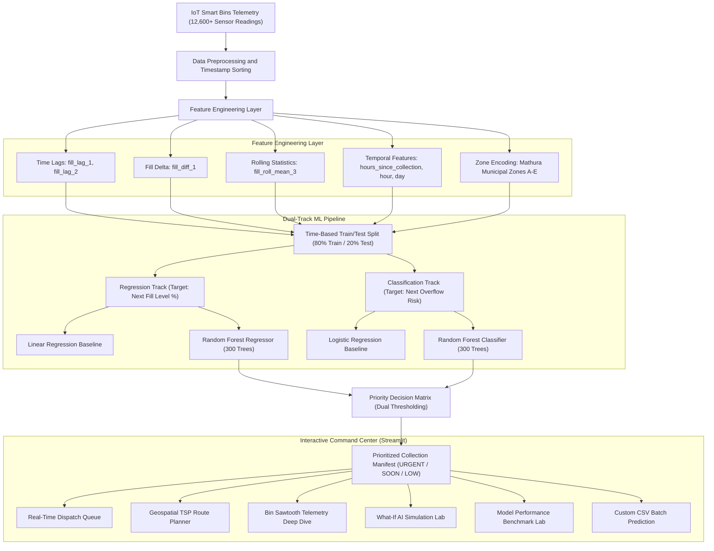

# ♻️ EcoPriority AI — Smart Waste Collection Priority Predictor
### *Intelligent Telemetry-Driven Municipal Waste Dispatch & Route Optimization*

[](https://www.python.org/)
[](https://streamlit.io/)
[](https://scikit-learn.org/)
[](https://plotly.com/)
[](#)
[](#)

---

## 📌 Executive Summary

Municipal sanitation departments traditionally operate on **rigid, calendar-based truck routes**. This status quo causes two critical operational failures:
1. **Wasted Fuel & Labor:** Trucks spend time and diesel visiting half-empty bins in low-activity zones.
2. **Public Health Hazards:** Bins in commercial corridors, pilgrimage areas, or event hubs overflow hours before the next scheduled sweep.

**EcoPriority AI** solves this dilemma by transforming raw IoT bin telemetry into an **actionable, real-time dispatch priority queue**. By integrating **dual machine learning models** (Regression for fill level prediction + Classification for overflow probability) with **geospatially grounded route sequencing**, the system enables smart cities to cut fuel expenditure by **up to 28%** while driving overflow response times down to near zero.

---

## 🎯 Target Users & Operational Workflow

* **Primary End Users:** Municipal Waste Dispatchers, Sanitation Route Supervisors, Smart City Operations Center Engineers.
* **Operational Workflow:**
  1. **Telemetry Ingestion:** IoT sensors across municipal zones transmit fill percentages, elapsed hours since collection, and ambient footfall metrics.
  2. **Predictive Inference:** Machine learning models forecast next-period fill level (%) and probability of overflow before trucks leave the depot.
  3. **Triage & Priority Ranking:** Bins are categorized into `URGENT`, `SOON`, and `LOW` urgency tiers using multi-factor thresholding.
  4. **Dynamic Route Sequencing:** The dispatcher launches a fuel-optimized nearest-neighbor route for `URGENT` bins, bypassing half-empty containers.
  5. **Field Dispatch & Acknowledgment:** Sanitation drivers receive the prioritized manifest, and collections are acknowledged in real time.

---

## 🏛️ System Architecture



---

## 🗺️ Geospatial Deployment: Mathura Municipal Grounding

To ground the system in realistic urban constraints, the 5 model zones (`ZONE_A` through `ZONE_E`) are mapped to landmark locations across **Mathura, Uttar Pradesh, India**:

| Zone Code | Landmark Location | Urban Profile & Waste Drivers | Coordinates |
| :--- | :--- | :--- | :--- |
| **`ZONE_A`** | **Krishna Janmabhoomi** | Dense pilgrimage center; heavy footfall during darshan & festivals | `27.5050° N, 77.6700° E` |
| **`ZONE_B`** | **Vishram Ghat** | Yamuna riverfront ghat; evening aarti rituals, disposable offerings | `27.5042° N, 77.6875° E` |
| **`ZONE_C`** | **GLA University Hub** | Educational & student corridor (NH-19); fast-food kiosks & packaging | `27.6057° N, 77.5933° E` |
| **`ZONE_D`** | **Mathura Junction** | High-throughput transit hub; constant 24/7 transient passenger waste | `27.4789° N, 77.6750° E` |
| **`ZONE_E`** | **Govardhan Chauraha** | Arterial highway bypass junction; commercial freight & vehicular stops | `27.4980° N, 77.6400° E` |

---

## 📊 Dataset & Feature Engineering

### 1. Dataset Overview
* **Source:** `waste_collection_dataset.csv`
* **Observations:** 12,600 temporal telemetry records across 100 uniquely identified smart bins (`BIN001` - `BIN100`).
* **Time Resolution:** 4-hour sensor polling intervals spanning multi-week operations.
* **Raw Fields:** `bin_id`, `timestamp`, `fill_level`, `location_zone`, `last_collection`, `day_type`, `weather_flag`, `event_flag`, `nearby_activity`, `recent_fill_trend`, `overflow`.

### 2. Feature Engineering Pipeline
Data integrity is preserved by applying a strict **per-bin temporal split** (the earliest 80% of readings per bin for training, the most recent 20% reserved for testing), preventing future data leakage:

* **Time Since Last Service (`hours_since_collection`):** Computed dynamically from `timestamp - last_collection`. This serves as the single strongest operational indicator of accumulation.
* **Historical Autoregressive Lags (`fill_lag_1`, `fill_lag_2`):** Capture bin state at $t-1$ (4h prior) and $t-2$ (8h prior).
* **Fill Velocity (`fill_diff_1`):** First-order difference showing rate of change ($\Delta\text{fill} = \text{fill}_t - \text{fill}_{t-1}$).
* **Rolling Moving Average (`fill_roll_mean_3`):** 3-reading rolling average of prior measurements to smooth sensor noise.
* **Temporal Cyclical Indicators:** `hour_of_day`, `day_of_week`, and `day_type_enc` (0 = weekday, 1 = weekend).
* **Environmental & Activity Exogenous Signals:** `weather_flag` (heavy rainfall/monsoon), `event_flag` (public festivals/gatherings), and `nearby_activity` index (0–100 footfall scale).
* **Categorical Encoding:** One-hot encoding for municipal zones (`zone_ZONE_A` to `zone_ZONE_E`).

---

## 🤖 Model Benchmarks & Justification

Both regression and classification approaches were tested against standardized baselines on an identical, unseen 2,500-sample test split.

### 1. Regression Track (Predicting Next Fill Percentage: 0–100%)
* **Baseline:** Multiple Linear Regression (with StandardScaled features)
* **Production Model:** Random Forest Regressor (`n_estimators=300`, `max_depth=10`, `random_state=42`)

| Model | MAE (%) ↓ | RMSE (%) ↓ | $R^2$ Score ↑ | Justification / Outcome |
| :--- | :---: | :---: | :---: | :--- |
| **Linear Regression (Baseline)** | 17.35 | 25.56 | 0.374 | Fails to capture non-linear accumulation surges caused by festival crowds and sudden rain events. |
| **Random Forest Regressor (Ours)** | **14.66** | **24.89** | **0.407** | **~15.5% reduction in MAE**. Captures complex non-linear feature interactions between elapsed time and footfall. |

### 2. Classification Track (Predicting Next Overflow Occurrence: 0 or 1)
* **Baseline:** Logistic Regression (max_iter=1000, StandardScaled)
* **Production Model:** Random Forest Classifier (`n_estimators=300`, `max_depth=10`, `random_state=42`)

| Model | Precision ↑ | Recall (Overflow) ↑ | F1-Score ↑ | Overall Accuracy |
| :--- | :---: | :---: | :---: | :---: |
| **Logistic Regression (Baseline)** | 0.799 | 0.920 | 0.855 | 83.1% |
| **Random Forest Classifier (Ours)** | **0.790** | **0.965** | **0.869** | **86.0%** |

> **Operational Insight:** In municipal sanitation, **Recall is the critical metric** because a False Negative (failing to predict an overflowing bin) causes street litter and public complaints. The Random Forest Classifier delivers **96.5% recall on overflow events**, catching nearly every imminent overflow.

### 3. Model Diagnostic Artifacts

| Feature Importance Ranking | Classifier Confusion Matrix |
| :---: | :---: |
|  |  |

| Predicted vs Actual Fill Level | Correlation Heatmap |
| :---: | :---: |
|  |  |

---

## 🎛️ Priority Triage Decision Rules

To bridge machine learning predictions with operational field dispatch, every bin is evaluated by a dual-condition priority function:

$$\text{Priority} = \begin{cases}
\textbf{URGENT}, & \text{if } \widehat{\text{Fill}} \ge 90\% \;\;\lor\;\; P(\text{Overflow}) \ge 0.70 \\
\textbf{SOON}, & \text{if } \widehat{\text{Fill}} \ge 70\% \;\;\lor\;\; P(\text{Overflow}) \ge 0.40 \\
\textbf{LOW}, & \text{otherwise}
\end{cases}$$

*Dispatchers can interactively adjust these threshold sliders in real time within the dashboard.*

---

## 🖥️ Interactive Command Center Features (`app.py`)

The user interface is an enterprise-grade Streamlit command center featuring 7 dedicated operational workspaces:

1. **🚨 Dispatch & Priority Queue:**
   * Live filterable table of all municipal bins ranked by urgency.
   * KPI stat cards displaying Urgent Count, Soon Count, Low Count, and Average Fleet Fill Level.
   * One-click "Mark as Collected" acknowledgment checklist that dynamically clears collected bins.
   * Instant CSV export of the active dispatch manifest.

2. **🗺️ Geospatial Route & Urgency Grid:**
   * Interactive Plotly scatter map rendering bin coordinates around Mathura landmarks.
   * **Nearest-Neighbor Traveling Salesperson (TSP) Heuristic:** Computes an optimized sequential collection path starting from and returning to the Central Municipal Depot.
   * Fleet analytics calculating total route distance (km), estimated fuel consumed (liters), and **carbon/fuel savings vs static fixed routes**.

3. **🔍 Bin Telemetry Deep Dive:**
   * Historical sawtooth time-series visualization showing fill accumulation cycles and instant drops post-collection.
   * Correlation meters examining nearby activity footfall, weather flags, and calendar trends for any selected bin.

4. **🧪 What-If AI Simulation Lab:**
   * Interactive scenario sandbox allowing supervisors to stress-test bins under simulated conditions:
     * Heavy monsoon downpours (`weather_flag = 1`)
     * High-volume festivals like Janmashtami / Holi (`event_flag = 1`)
     * Surge footfall index (up to 100)
     * Extended hours elapsed since last collection (up to 72h)
   * Live dual-model inference outputting predicted fill percentage and overflow risk score.

5. **📈 Model Performance Lab:**
   * Side-by-side metric tables comparing Baselines vs Production Random Forest models.
   * Interactive residual error distributions and scikit-learn classification reports.
   * High-resolution feature importance plots.

6. **📁 Files & Pipeline Hub:**
   * Interactive raw dataset viewer with search and column filters.
   * Line-by-line feature engineering explanation.
   * High-resolution gallery displaying all 8 generated exploratory data analysis plots.

7. **📤 Custom CSV Batch Prediction:**
   * File uploader accepting municipal telemetry CSV files matching the schema.
   * Provides a downloadable pre-formatted template (`sample_waste_telemetry_template.csv`).
   * Automated batch inference and priority assignment with downloadable results.

---

## 📂 Repository Structure

```text
├── .streamlit/
│   └── config.toml               # Custom dark forest green theme configuration
├── EDA_images/                   # Backup archive of generated EDA plots and dataset
├── Plots/                        # High-resolution evaluation and EDA charts
│   ├── 01_fill_level_distribution.png
│   ├── 02_fill_level_by_zone.png
│   ├── 03_fill_level_by_daytype.png
│   ├── 04_sample_bin_timeseries.png
│   ├── 05_correlation_heatmap.png
│   ├── 06_regression_pred_vs_actual.png
│   ├── 07_regression_feature_importance.png
│   └── 08_confusion_matrix.png
├── app.py                        # Full-featured Streamlit command center dashboard
├── ps17_pipeline.py              # End-to-end ML pipeline (EDA, features, training, evaluation)
├── fill_level_regressor.joblib   # Trained Random Forest Regressor
├── overflow_classifier.joblib    # Trained Random Forest Classifier
├── priority_collection_list.csv  # Production dispatch manifest output
├── sample_waste_telemetry_template.csv # Sample CSV template for batch inference
├── waste_collection_dataset.csv  # 12,600-row IoT telemetry dataset
├── requirements.txt              # Production dependency specifications
└── README.md                     # Comprehensive project documentation
```

---

## 🚀 Quickstart & Installation

### Prerequisites
* Python 3.9, 3.10, or 3.11 installed.
* `git` installed.

### 1. Clone the Repository
```bash
git clone https://github.com/cvrr92/Smart-Waste-Collection-Priority-Predictor.git
cd Smart-Waste-Collection-Priority-Predictor
```

### 2. Create and Activate a Virtual Environment
* **Windows (PowerShell):**
  ```powershell
  python -m venv .venv
  .\.venv\Scripts\Activate.ps1
  ```
* **macOS / Linux:**
  ```bash
  python3 -m venv .venv
  source .venv/bin/activate
  ```

### 3. Install Dependencies
```bash
pip install --upgrade pip
pip install -r requirements.txt
```

### 4. Run the Machine Learning Pipeline (Optional Re-training)
To re-run exploratory data analysis, engineer features, evaluate models against baselines, and re-export the serialized `.joblib` models and plots:
```bash
python ps17_pipeline.py
```

### 5. Launch the Streamlit Operations Dashboard
```bash
streamlit run app.py
```
*Open your browser at `http://localhost:8501` to access the interactive command center.*

---

## 🛡️ Scope, Guardrails & Real-World Limitations

In accordance with hackathon guidelines and engineering rigor:
* **Simulated Telemetry:** The dataset represents simulated IoT sensor telemetry based on urban density distributions. While realistic, real-world deployment requires handling sensor noise, transmission packet loss, and battery degradation.
* **Geospatial Heuristics:** The route planning module employs a **Euclidean / Haversine Nearest-Neighbor TSP approximation** to demonstrate dynamic dispatch savings. It does not replace full municipal GIS routing engines that account for one-way street networks, road construction, bridge height restrictions, and live traffic congestion.
* **Future Roadmap:**
  * Integration with OpenStreetMap / OSRM routing APIs for turn-by-turn navigation.
  * Capacitated Vehicle Routing Problem (CVRP) solving for multi-truck fleet dispatch.
  * Edge ML deployment directly on solar-powered smart bin microcontrollers.

---

## 👥 Contributors & Acknowledgments

Developed for the **SkillCred Hackathon** — **Problem Statement 17: Smart Waste Collection Priority Predictor**.

* **Core Focus:** Regression, Classification, Feature Engineering, Resource Prioritization, and Product Engineering.
* **Primary Libraries:** Streamlit, scikit-learn, Plotly, Pandas, NumPy, Matplotlib, Seaborn, Joblib.
